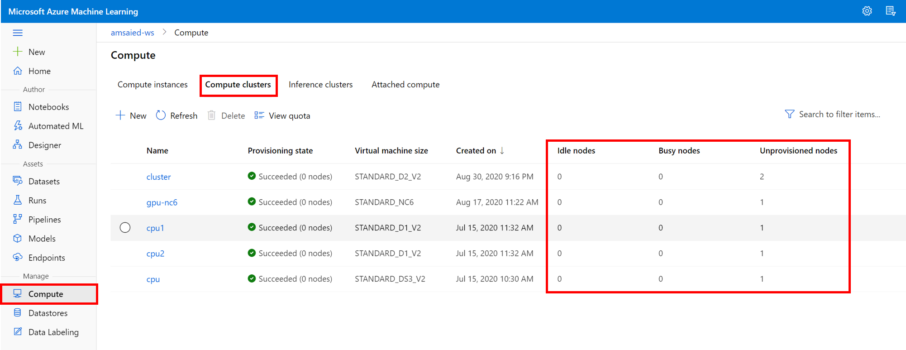
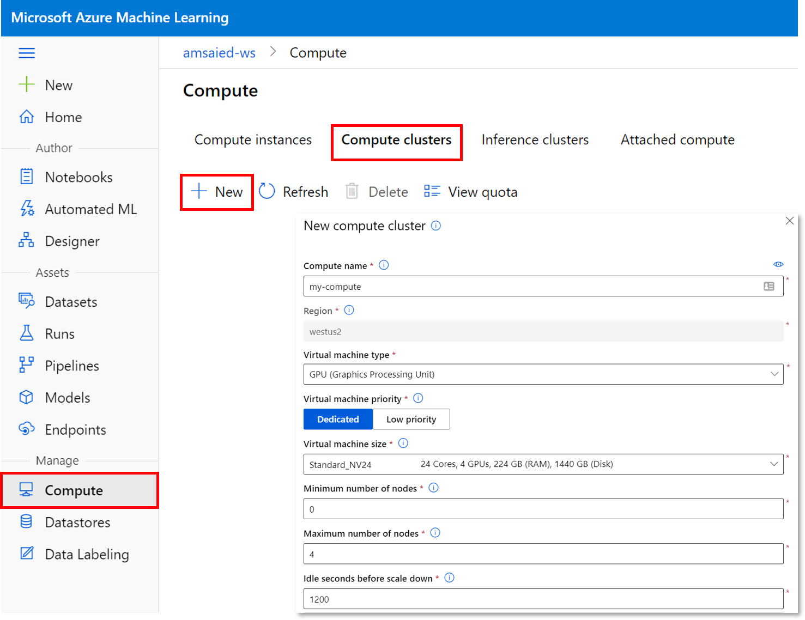
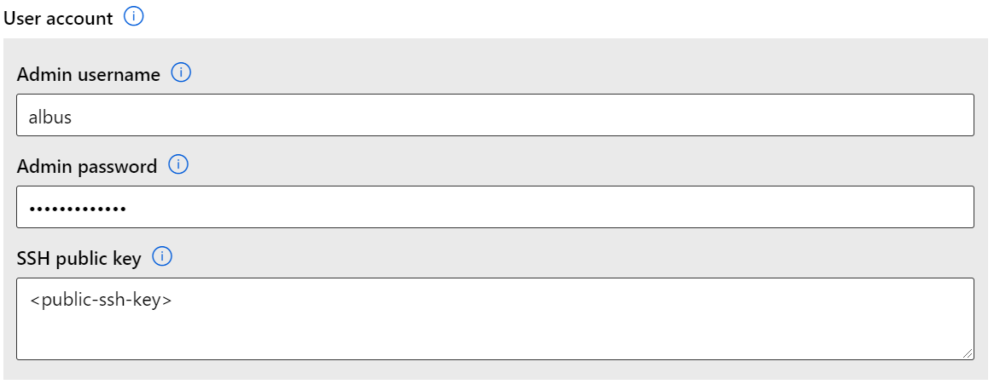

Compute Target (コンピューティングターゲット) は AML の計算環境の概念を抽象化したものです。対象はローカルマシンから Azure VM で構成されるクラスターまで様々です。


### Compute Target の取得

ワークスペース `ws` にある既存の Compute Target の取得:

```python
from azureml.core import ComputeTarget
target = ComputeTarget(ws, '<compute_target_name>')
```

### 既存 Compute Target のリスト

ワークスペース `ws` にある Compute Target のリストの取得:

```python
ComputeTarget.list(ws): List[ComputeTarget]
```

### 空き状況の確認

ワークスペースをチームで共有するときには、ジョブを実行する前にワークスペース `ws` の計算環境が利用可能か確認することがよくあります。

[studio](https://ml.azure.com) から簡単に確認することができます。



## Compute Target の作成

[studio](https://ml.azure.com) から簡単に新しい Compute Target が作成できます。

"コンピューティング" のメニュー選択> "コンピューティングクラスタ" のタブを選択 > "+ 新規作成" ボタンを選択:



作成時に次の情報を入力します。:

- **コンピューティング名**: 後に studio や Python SDK から参照するのに利用されます。入力必須です。名前は 名前の長さは 2 から 16 文字の間でなければなりません。有効な文字は英字、数字、- 文字です。
- **仮想マシンの種類**: "CPU" or "GPU"
- **仮想マシンの優先度**: "専用" もしくは "低優先度" 
> 低優先度の仮想マシンは安く使えますが、計算環境の確保を保証していません。ジョブが途中で中断される場合があります。
- **仮想マシンのサイズ**: ドロップダウンリストから選択します。利用可能な仮想マシンのサイズの一覧は[こちら](https://azure.microsoft.com/global-infrastructure/services/?products=virtual-machines)です。
- **最小 / 最大ノード数**: Compute Target は実行されたジョブの数に依って最小ノード数と最大ノード数の間でオートスケースします。最小ノード数を 0 に設定することで計算環境上でのジョブが完了すると自動で 0 台に縮小するためコストを節約できます。
- **スケールダウンする前のアイドル時間 (秒)**: 計算環境をスケールダウンする前のアイドル時間を指定します。

備考: 計算環境を常に Azure Machine Learning Workspace と同じリージョンに作成されます。

### SSH の利用

管理者ユーザ名とパスワード・SSH キーを設定することで、Compute Target に対して SSH で接続できます。



### 低優先度 の Compute Target

低優先度の仮想マシンは安く使えますが、計算環境の確保を保証していません。ジョブが途中で中断される場合があります。


### SDK 経由での作成

SDK 経由での Compute Target の作成:

```python
from azureml.core import Workspace
from azureml.core.compute import ComputeTarget, AmlCompute
from azureml.core.compute_target import ComputeTargetException

ws = Workspace.from_config() # .azureml フォルダのファイルから接続情報を参照

# CPU クラスターの名前を選択
cpu_cluster_name = "cpu-cluster"

# 既存のクラスターが無いことを確認
try:
    cpu_cluster = ComputeTarget(workspace=ws, name=cpu_cluster_name)
    print('Found existing cluster, use it.')
except ComputeTargetException:
    compute_config = AmlCompute.provisioning_configuration(vm_size='STANDARD_D2_V2',
                                                           max_nodes=4, 
                                                           idle_seconds_before_scaledown=2400)
    cpu_cluster = ComputeTarget.create(ws, cpu_cluster_name, compute_config)

cpu_cluster.wait_for_completion(show_output=True)
```