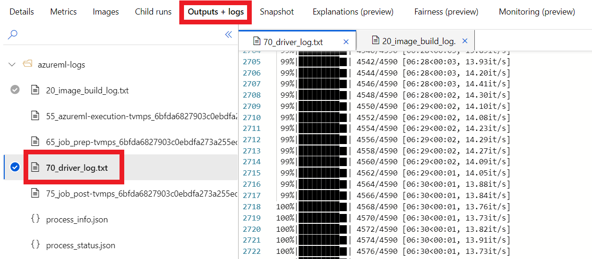

:::note
このコンテンツはお使いの言語では利用できません。
:::

## Azure ML Log Files

Azure ML's log files are an essential resource for debugging your Azure ML workloads.

| Log file | Description |
| - | - |
| `20_image_build_log*.txt` | Docker build logs. Only applicable when updating your Environment. Otherwise Azure ML will reuse cached image. <br/><br/> If successful, contains image registry details for the corresponding image.|
| `55_azureml-execution*.txt` | Pulls image to compute target. Note, this log only appears once you have secured compute resources.|
| `65_job_prep*.txt` | Job preparation: Download your code to compute target and datastores (if requested). |
| **`70_driver_log.txt`** | **The standard output from your script. This is where your code's logs (e.g. print statements) show up.** <br/><br/> In the majority of cases you will monitor the logs here. |
| `75_job_post*.txt` | Job release: Send logs, release the compute resources back to Azure. |

:::info
You will not necessarily see every file for every run. For example, the `20_image_build_log*.txt` only appears when a new image is built (e.g. when you change you environment).
:::

### Find logs in the Studio

These log files are available via the Studio UI at https://ml.azure.com under Workspace > Experiment >
Run > "Outputs and logs".



### Streaming logs

It is also possible to stream these logs directly to your local terminal using a `Run` object,
for example:

```python
from azureml.core import Workspace, Experiment, ScriptRunConfig
ws = Workspace.from_config()
config = ScriptRunConfig(...)
run = Experiment(ws, 'my-amazing-experiment').submit(config)
run.wait_for_completion(show_output=True)
```

## SSH

It can be useful to SSH into your compute for a variety of reasons - including to assist in debugging.

:::warning Enable SSH at compute creation
SSH needs to be enabled when you create the compute instance / target - see [Compute Targets](compute-targets#with-ssh) for details.
:::

1. Get **public ip** and **port number** for your compute.

  Visit [ml.azure.com](https://ml.azure.com/) > select "Compute" tab > Locate the desired compute instance / target.

  **Note.** The compute needs to be running in order to connect.
    - In the case of compute instance this just requires turning it on.
    - For compute targets there should be something running on the cluster. In this case you can select the "Nodes" tab of the cluster ([ml.azure.com](https://ml.azure.com/) > Compute > _your compute target_ > Nodes) to get Public IP & port number for each node.

2. Open your favorite shell and run:

  ```bash
  ssh azureuser@<public-ip> -p <port-number>
  ```


:::info SSH key pair using RSA
We recommend setting up SSH public-private key pair: see [here](https://docs.microsoft.com/en-us/azure/virtual-machines/linux/mac-create-ssh-keys) for more details.
:::

