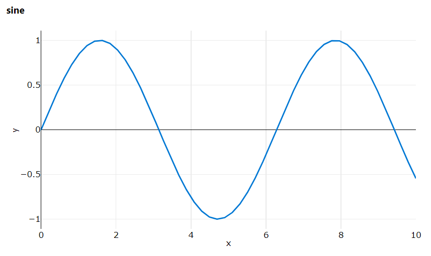

## 実験と実行

Azure ML は機械学習コードのクラウド上での実行を支援するサービスです。`実行`は Azure ML にサブミットされたジョブの履歴をただ保存するだけではなく、リアルタイムで監視することもできる抽象レイヤーです。

- 実行: 一度のコード実行を表します。詳細: [Run](#run)
- 実験: 実験は`実行`の軽量なコンテナです。実験は実行の Azure ML へのサブミットと追跡に使われます。

ワークスペース`ws`に実験を作成します。

```python
from azureml.core import Experiment
exp = Experiment(ws, '<experiment-name>')
```

## ScriptRunConfig

一般的に Azure ML では`ScriptRunConfig`を使って実行するコードの情報と実行のための設定情報をパッケージ化して、クラウド上にサブミットして実行します。

実行しようとしているコードが以下のディレクトリ構成だとします。

```bash
source_directory/
    script.py    # コードのエントリーポイント
    module1.py   # script.py によって呼ばれるモジュール
    ...
```

`ScriptRunConfig`を使って`script.py`をクラウド上で実行するための設定:

```python
config = ScriptRunConfig(
    source_directory='<path/to/source_directory>',
    script='script.py',
    compute_target=target,
    environment=env,
    arguments = [
        '--learning_rate', 0.001,
        '--momentum', 0.9,
    ]
)
```

ここで:

- `source_directory='source_directory'` : 実行するコードが存在するローカルディレクトリ。
- `script='script.py'` : 実行する Python スクリプト。必ずしも`source_directory`のルートにある必要はない。
- `compute_taget=target` : 参照 [Compute Target](copute-target)
- `environment` : 参照 [Environment](environment)
- `arguments` : 参照 [Arguments](#command-line-arguments)

このコードを Azure ML にサブミットする:

```python
exp = Experiment(ws, '<exp-name>')
run = exp.submit(config)
print(run)
run.wait_for_completion(show_output=True)
```

このコードはターミナル上にログストリームを出力するだけではなく、サブミットされた実行を Web 上で監視するためのリンクを出力します。(https://ml.azure.com)

## コマンドライン引数

スクリプトにコマンドライン引数を渡すには`ScriptRunConfig`の中にある`arguments`パラメータを使います。
引数は list 形式で指定します:

```python
arguments = [first, second, third, ...]
```

このとき引数は下記のコマンドライン引数のように渡されます:

```console
$ python script.py first second third ...
```

名前付きの引数もサポートされます:

```python
arguments = ['--first_arg', first_val, '--second_arg', second_val, ...]
```

引数には`int`、`float`、`str`などのデータ型に加えて他の参照型のデータも使えます。

コマンドライン引数の詳細: [Use dataset in a remote run](dataset#use-dataset-in-a-remote-run)

### 引数の例 1: `sys.argv`

この例では 2 つの引数をスクリプトに渡します。コンソールから実行する場合:

```console title="console"
$ python script.py 0.001 0.9
```

これを`ScriptRunConfig`の中の`arguments`を使って表現する場合:

```python title="run.py"
arguments = [0.001, 0.9]

config = ScriptRunConfig(
    source_directory='.',
    script='script.py',
    arguments=arguments,
)
```

これらの引数はスクリプトの中で通常のコマンドライン引数と同じように使えます:

```python title="script.py"
import sys
learning_rate = sys.argv[1]     # 0.001 を受け取る
momentum = sys.argv[2]          # 0.9 を受け取る
```

### 引数の例 2: `argparse`

この例では 2 つの名前付きの引数をスクリプトに渡します。コンソールから実行する場合:

```console title="console"
$ python script.py --learning_rate 0.001 --momentum 0.9
```

これを`ScriptRunConfig`の中の`arguments`を使って表現する場合:

```python title="run.py"
arguments = [
    '--learning_rate', 0.001,
    '--momentum', 0.9,
    ]

config = ScriptRunConfig(
    source_directory='.',
    script='script.py',
    arguments=arguments,
)
```

これらの引数はスクリプトの中で通常のコマンドライン引数と同じように使えます:

```python title="script.py"
import argparse
parser = argparse.Argparser()
parser.add_argument('--learning_rate', type=float)
parser.add_argument('--momentum', type=float)
args = parser.parse_args()

learning_rate = args.learning_rate      # 0.001 を受け取る
momentum = args.momentum                # 0.9 を受け取る
```

## コマンド

明示的に実行するコマンドを与えることもできます。

```python
command = 'python script.py'.split()

config = ScriptRunConfig(
    source_directory='<path/to/code>',
    command=command,
    compute_target=compute_target,
    environment=environment,
)
```

この例は`command`引数の代わりに`script='script.py'`という引数をするということと同じです。

このオプションは多くの柔軟性を与えます。例えば:

- **環境変数の設定**: よくある例:

    ```python
    command = 'export PYTHONPATH=$PWD && python script.py'.split()
    ```

    ```python
    command = f'export RANK={rank} && python script.py'.split()
    ```

- **セットアップスクリプトの実行**: データのダウンロードや環境変数の設定を行うセットアップスクリプトの実行。

    ```python
    command = 'python setup.py && python script.py'.split()
    ```

## データセットの使用

### 引数から

`ScriptRunConfig`に引数としてデータセットを渡します。

```py
# データセットを作成する
datastore = ws.get_default_datastore()
dataset = Dataset.File.from_files(path=(datastore, '<path/on/datastore>'))

arguments = ['--dataset', dataset.as_mount()]

config = ScriptRunConfig(
    source_directory='.',
    script='script.py',
    arguments=arguments,
)
```

この例では`script.py`から参照可能な実行に対してデータセットがマウントされます。

## 実行

### インタラクティブ

Jupyter Notebookなどを使う場合のインタラクティブ設定

```python
run = exp.start_logging()
```

#### 例 : Jupyter Notebook

よくあるユースケースはノートブック内で学習中のモデルのログをインタラクティブに表示する場合です。

```py
from azureml.core import Workspace
from azureml.core import Experiment
ws = Workspace.from_config()
exp = Experiment(ws, 'example')

run = exp.start_logging()                   # インタラクティブ実行の開始
print(run.get_portal_url())                 # Azure ML Studio へのリンクの取得

# モデル学習コードのダミー
# 実際は学習やEDAなど
import numpy as np
for x in np.linspace(0, 10):
    y = np.sin(x)
    run.log_row('sine', x=x, y=y)           # メトリックのロギング

run.complete()                              # インタラクティブ実行の終了
```

Azure ML Studio へのリンクからリアルタイムでメトリックのログや実行を確認できます。



### コンテキストの取得

Azrue ML 上で実行されているコードは`実行`に関連付けられます。サブミットされたコードは`実行`からアクセスすることができます。

```py
from azureml.core import Run
run = Run.get_context()
```

#### 例: 実行中のコードのメトリックをログに保存する

よくあるユースケースはトレーニングスクリプト内でのメトリックのログです。

```py title="train.py"
from azureml.core import Run

run = Run.get_context()

# training code
for epoch in range(n_epochs):
    model.train()
    ...
    val = model.evaluate()
    run.log('validation', val)
```

このコードが Azrue ML (例えば`ScriptRunConfig`により) にサブミットされた時、このコードは関連付けられている`実行`にメトリックのログを保存します。

詳細: [Logging Metrics](logging)